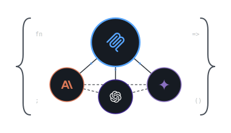

# CCG MCP Tool (Claude Code/Codex/Gemini)

<div align="center">



[](https://github.com/diaz3618/ccg-mcp-tool/releases)
[](https://www.npmjs.com/package/@diazstg/ccg-mcp-tool)
[](https://www.npmjs.com/package/@diazstg/ccg-mcp-tool)
[](https://opensource.org/licenses/MIT)

</div>

MCP server that integrates **Claude Code**, **OpenAI Codex**, and **Google Gemini** into a single workflow. Analyze codebases with Gemini's massive context window, get precision edits with Codex, or use Claude's reasoning — all from one MCP interface.

## [](https://claude.com/product/claude-code)  [](https://geminicli.com/)  [](https://developers.openai.com/codex/cli)

## Quick Start

```bash
claude mcp add ccg-tool -- npx -y @diazstg/ccg-mcp-tool
```

Or configure manually:

```json
{
  "mcpServers": {
    "ccg-tool": {
      "command": "npx",
      "args": ["-y", "@diazstg/ccg-mcp-tool", "--provider", "gemini", "--agent-mode", "read-only"]
    }
  }
}
```

### Prerequisites

- [Node.js](https://nodejs.org/) v16+
- At least one AI CLI: [Gemini CLI](https://github.com/google-gemini/gemini-cli), [Codex CLI](https://github.com/openai/codex), or [Claude Code](https://claude.com/product/claude-code)

## Tools

| Tool | Description |
|------|-------------|
| `ask-ai` | Universal AI analysis across providers |
| `brainstorm` | Structured ideation (SCAMPER, lateral, etc.) |
| `mitigate-mistakes` | Research-grounded gates for common AI failures |
| `coordinate-review` | Coordinated multi-gate review by task type |
| `deploy-agents` | Multi-agent orchestration (parallel/sequential/fan-out) |
| `agent-status` | Monitor orchestration sessions |
| `fetch-chunk` | Retrieve chunks from large responses |
| `ping` | Test connectivity |
| `Help` | List available tools |
| `timeout-test` | Developer timeout testing |

## Documentation

- [Getting Started](docs/getting-started.md)
- [Tools Reference](docs/tools.md)
- [Providers & Models](docs/providers.md)
- [Multi-Agent Orchestration](docs/multi-agent.md)
- [Mitigation Skills](docs/mitigation.md)
- [Architecture](ARCHITECTURE.md)

## License

MIT — see [LICENSE](LICENSE).

**Disclaimer:** This is an unofficial tool and is not affiliated with Google, OpenAI, or Anthropic.
