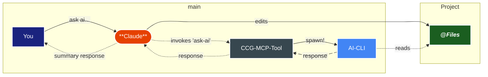

# How It Works

## Natural Language Workflow Integration

The **CCG MCP Tool** is designed to seamlessly integrate into your natural workflow with your preferred MCP-compliant AI clients, achieved through carefully crafted tools and pipelines.

Claude automatically decides when to use `ask-ai` (or `ask-gemini`) based on context:

- comparative analysis - different AI perspectives (Gemini, Codex, Claude) for validation
- leveraging extra tools - Multi-provider search and reasoning functions
- code review & big changes - second opinions on implementation with research-grounded gates
- creative problem solving - brainstorming and ideation across different AI frameworks

This intelligent selection enhances your workflow exactly when the selected AI's capabilities add value.

When ask-ai gets called:

<DiagramModal>

</DiagramModal>
